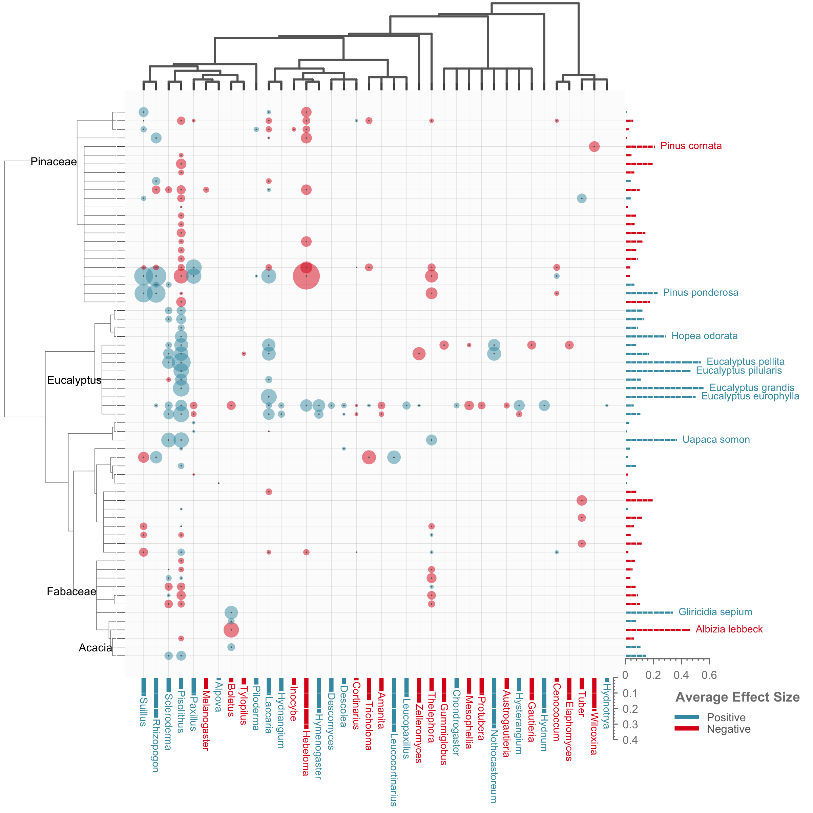
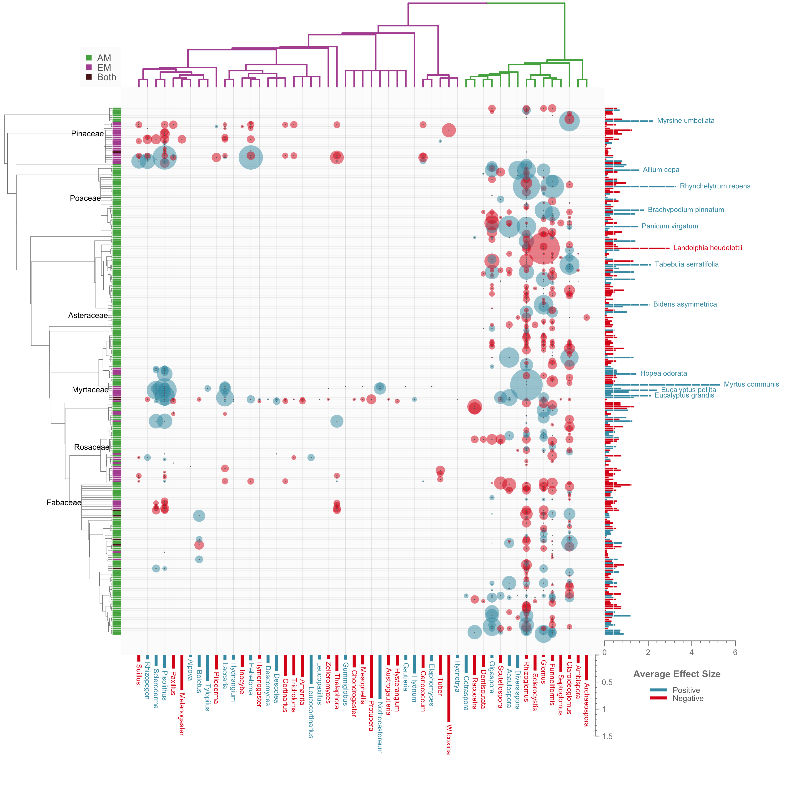

## dualingTrees R Package

#### James Meadow

#### 5/19/2017


-----------

This package is designed to produce one type of visualization: phylogenetic effect sizes resulting from ecological interactions. This was designed to visualize mycorrhizal interactions, but could potentially be applied more broadly, as long as there are members of two phylogenies interacting in some way. 

The work arose from a long-term MycoDB collaboration announced by Chaudhary et al. (2016; https://www.nature.com/articles/sdata201628). Additional publications are forthcoming, including publications surrounding the data used for examples within this package. 


#### Installation: 

Currently only housed on GitHub, so you can install using `devtools`: 

```
library(devtools)
install_github("jfmeadow/dualingTrees-pkg", subdir="dualingTrees")
```

#### Workflow: 

You will need at least 3 objects to generate a figure: 

* `x_tree`: a phylo object (see the ape package) for the tree that goes on the top axis. 
* `y_tree`: a phylo object (see the ape package) for the tree that goes on the left axis. 
* And a 3-column data.frame consisting of: 
  * `x_key`: names of organisms that match the tips of the `x_tree`. 
  * `y_key`: names of organisms that match the tips of the `y_tree`. 
  * `response`: the effect size or any other numeric interaction value to be displayed on the figure. These can be many replicate measures (to be averaged for each bubble size) or a single response value for each interaction combination (which would directly be plotted as a bubble). 
  * Optionally, you can supply a categorical variable indicating the interaction type `response_type`. This will be used to color tree tips. Currently only 2 categories are allowed, with a third `both` category created on the fly when a single combination appears in two categories. 
  
All other options are documented in the help files. 


The package consists of 2 main functions that must be run in series, as well as a few internal ancillary functions. The typical workflow might look like this: 

```
library(dualingTrees)

## these are example datasets included in this package
data(fungal_tree_blup)
data(plant_tree_blup)
data(blup)

blup_trees_list <- 
  input_trees(
    x_tree = fungal_tree_blup,
    y_tree = plant_tree_blup,
    x_key = blup$fungus,
    y_key = blup$plant,
    response = blup$intrcpt,
    bubble_scale=5, 
    bubble_transform='sqrt', 
    y_lab_cutoff = 0.2,
    y_node_labs = c('fabaceae', 'eucalyptus', 'acacia', 'pinaceae'))
    
plot_trees(
  trees_list = blup_trees_list,
  pn_cols = c('#409ab1', '#dd1d18'),
  x_tree_col = 'gray40',
  x_bar_axis_offset = .6, 
  y_bar_axis_offset = .6, 
  x_space = .3, 
  y_space = .5, 
  png_filename = 'blup_trees.png', 
  w_inches = 8, 
  h_inches = 8, 
  leg_text_pos = .6)

```

Which results in this figure: 




Here is another example, slightly more complex: 


```
data(fungal_tree)
data(plant_tree)
data(mycor_ei)

trees_list <- 
  input_trees(
    x_tree = fungal_tree,
    y_tree = plant_tree,
    x_key = mycor_ei$fungal_name,
    y_key = mycor_ei$plant_name,
    response = mycor_ei$ei,
    response_type = mycor_ei$mycorrhizae_type,
    bubble_scale=5, 
    x_lab_cutoff = NULL,
    y_lab_cutoff = 1.4,
    x_node_labs = NULL,   
    y_node_labs = c('fabaceae', 'betulaceae', 
                    'rosaceae', 'myrtaceae', 
                    'asteraceae', 'poaceae', 
                    'pinaceae'))
    
## vector for x tree edge colors.
x_tree_cols <- rep('gray40', length(trees_list$x_tree$edge.length))
x_tree_cols[1:65] <- '#b154a0'
x_tree_cols[66:94] <- '#51ad4f'

plot_trees(
  trees_list = trees_list,
  pn_cols = c('#409ab1', '#dd1d18'),
  x_tree_col = x_tree_cols,
  x_type_cols = c('#51ad4f', '#b154a0'),
  y_type_cols = c('#51ad4f', '#b154a0', '#5a1b1a'),
  x_bar_axis_offset = .5, 
  y_bar_axis_offset = .5, 
  png_filename = 'ei_tree.png', 
  leg_text_pos = .4)
  
```

And the result: 




